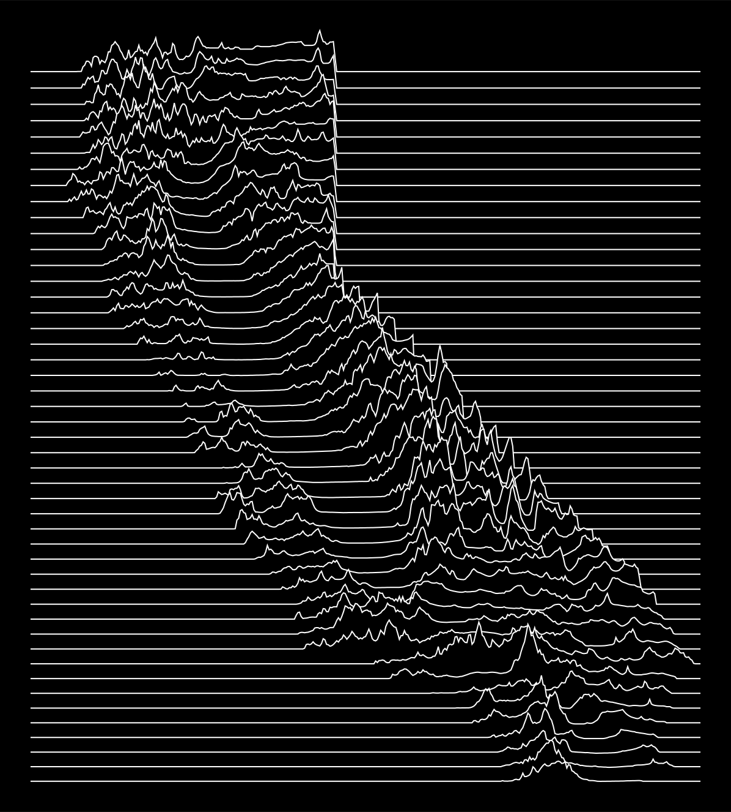

# Topographic Pleasures

Every US state drawn the way Peter Saville's sleeve for Joy Division's *Unknown
Pleasures* drew a pulsar: one line per latitude, lifted by the land beneath it,
each line hiding the ones behind. Joy Division turned scientific data into art;
this project borrows that connection between the scientific and the creative
and applies it to real elevation data, so each state is at once recognisable
and novel.

The front page is a map of the United States, Alaska and Hawaii included:
faint state outlines filled with flat lines. Move the pointer over a state (or
over its name in the list below the map) and its lines rise to show its
terrain; click it to open the state's page. There you can tune the drawing
(how many lines, how tall the mountains, how fine the detail, the projection
and the colours) and download it as an SVG or a one-page vector PDF. Every
drawing is made in the browser from the state's elevation grid; the build also
ships each state at the default settings under `downloads/`.

It began in 2021 as *California Pleasures*, a Python script over USGS 3DEP
tiles (the original render is in `docs/`):



## Layout

```
site/            the website source (copied to dist/ by the build)
  index.html     the map and the per-state workbench (one page, routed by the hash)
  style.css
  icon.svg
  js/
    pleasures.js the renderer: grid decoding, sampling, projection, SVG and PDF output
    map.js       the front-page map: flat lines, the state under the pointer raised
    app.js       the routing, the map's pointer handling, the controls, downloads and links
  data/          built, not in git: states.json, one grid per state (~32 MB) and map.bin
  downloads/     built, not in git: each state at the default settings as SVG and PDF
dist/            the assembled static site, built by `make dist`, not in git
tools/
  fetch_data.sh  downloads the source datasets into sources/ (not in git)
  build_data.py  converts sources/ into site/data/
  render.mjs     draws site/downloads/ with site/js/pleasures.js
  SHA256SUMS     checksums of every download
  requirements.txt
docs/            the 2021 California render
Makefile         make dist | data | build | render | fetch | serve | clean
package.json     no dependencies; it only marks the JavaScript as ES modules for Node
```

## Building and running

Prerequisites, installed once by hand (the build never installs anything):

* Python 3.8 or newer with `numpy` and `pyshp` 2.x: `pip install -r tools/requirements.txt`
* Node 18 or newer (renders the previews with the site's own JavaScript)
* `curl`, `unzip`, `sha256sum` (coreutils) and `make`

```
make check          # verify the prerequisites; one line per missing item
make dist           # check, fetch and verify the data (~190 MB, once), build the grids, render, assemble dist/
make serve          # the same, then python3 -m http.server 8000 --directory dist
```

then open http://localhost:8000/. `make dist` runs from a fresh clone with no
arguments, keeps downloads it already has, and rebuilds `dist/` cleanly each
time. `make clean` removes `dist/` and everything generated but keeps the
downloads. For development, `python3 tools/build_data.py CA NV` and
`node tools/render.mjs ca nv` rebuild single states.

Downloads land in `sources/` and are checked against the SHA-256 sums in
`tools/SHA256SUMS` before use; a file that fails is deleted and the build stops
with a message, so a truncated download is never processed (re-run `make` to
fetch it again). Any failed step exits non-zero with a one-line message on
stderr, and `dist/` is only written once everything else has succeeded.

`dist/` is a self-contained static site: every URL to its own files is
relative, and the only external resource is the Jost typeface from Google
Fonts. The front page loads only `states.json` and the 0.4 MB `map.bin`; the
largest file is Alaska's 2 MB grid, fetched when that state is opened. When
`site/data/` changes, bump `DATA_VERSION` in `site/js/app.js` so browsers (and
the site's year-long cache) refetch the files.

## How a state is drawn

1. `tools/build_data.py` mosaics the GMTED2010 30 arc-second tiles, crops the
   state's bounding box, block-averages it to at most 1200 columns, and masks it
   with the state outline (cells outside the state become nodata; sea and lake
   cells inside the outline keep their value). Longitudes east of the
   antimeridian are shifted by −360° so Alaska is one grid, and Hawaii is
   clipped to its eight main islands. The result is `site/data/<xx>.bin`, a
   64-byte header (documented in `write_grid`) followed by int16 metres.
2. `site/js/pleasures.js` projects the state's latitude range (Mercator by
   default), places the lines at equal projected spacing, and for each line
   takes the nearest grid row, block-averaged to about the requested number of
   points. Blocks start afresh at every run of in-state cells and each run gets
   a baseline point at both edges, so a line always drops to the baseline
   exactly at the state's border (and at every coast and lakeshore), whatever
   the detail. Outside the state a line is flat. A state's highest point rises
   `relief` line spacings (5 by default).
3. The lines are drawn north to south, each as a shape filled with the
   background colour and stroked with the line colour, so nearer lines hide
   farther ones. The SVG is exactly what the page shows; the PDF is the same
   paths on one page 1000 pt (35 cm) wide.

Settings live in the URL (`#ca?lines=80&relief=4&projection=equirectangular`),
so a drawing can be shared by its link.

The front-page map is precomputed by `build_map` in `tools/build_data.py`:
one picture 1000 × 700 units, the lower 48 in Mercator across the top and
Alaska and Hawaii as insets in the lower left, crossed by the same horizontal
lines. `map.bin` records, for every sample along every line, the elevation
there and which state owns it (a 32-byte header, then int16 metres and uint8
state numbers); `outlines.json` holds each state's outline on the same map as
an SVG path, simplified to the map's scale. The page draws the outlines, then
every line flat wherever a state owns the samples (so the sea, Canada, Mexico
and the Great Lakes are empty), and when the pointer is over a state or its
name in the list, rewrites just that state's lines with its terrain. A state's highest
point rises 5 line spacings scaled by the square root of its height relative
to the highest state, with a floor of 1.2 spacings, so the flat states still
visibly rise without matching the Rockies. On a touch screen the first tap
raises a state and the second opens it; the list of states under the map
works without a pointer at all.

## Data credits

* **GMTED2010** — Danielson, J.J., and Gesch, D.B., 2011, Global
  multi-resolution terrain elevation data 2010 (GMTED2010): U.S. Geological
  Survey Open-File Report 2011–1073. 30 arc-second mean elevation tiles,
  version 20101117, from the USGS EROS Center. Public domain.
* **US Census Bureau** cartographic boundary files, 2023, states at
  1:500,000 (`cb_2023_us_state_500k`). Public domain.
* **Jost** typeface by indestructible type*, SIL Open Font License, from
  Google Fonts.
* *Unknown Pleasures* (Factory Records, 1979): sleeve by Peter Saville after
  Harold D. Craft's 1970 plot of successive pulses from the pulsar CP 1919,
  as printed in the Cambridge Encyclopaedia of Astronomy.

The 2021 California render used USGS 3DEP 1 arc-second tiles and Census TIGER
state boundaries via the HIFLD open data portal.

## Licence

GPL-3.0, see `LICENSE`.
